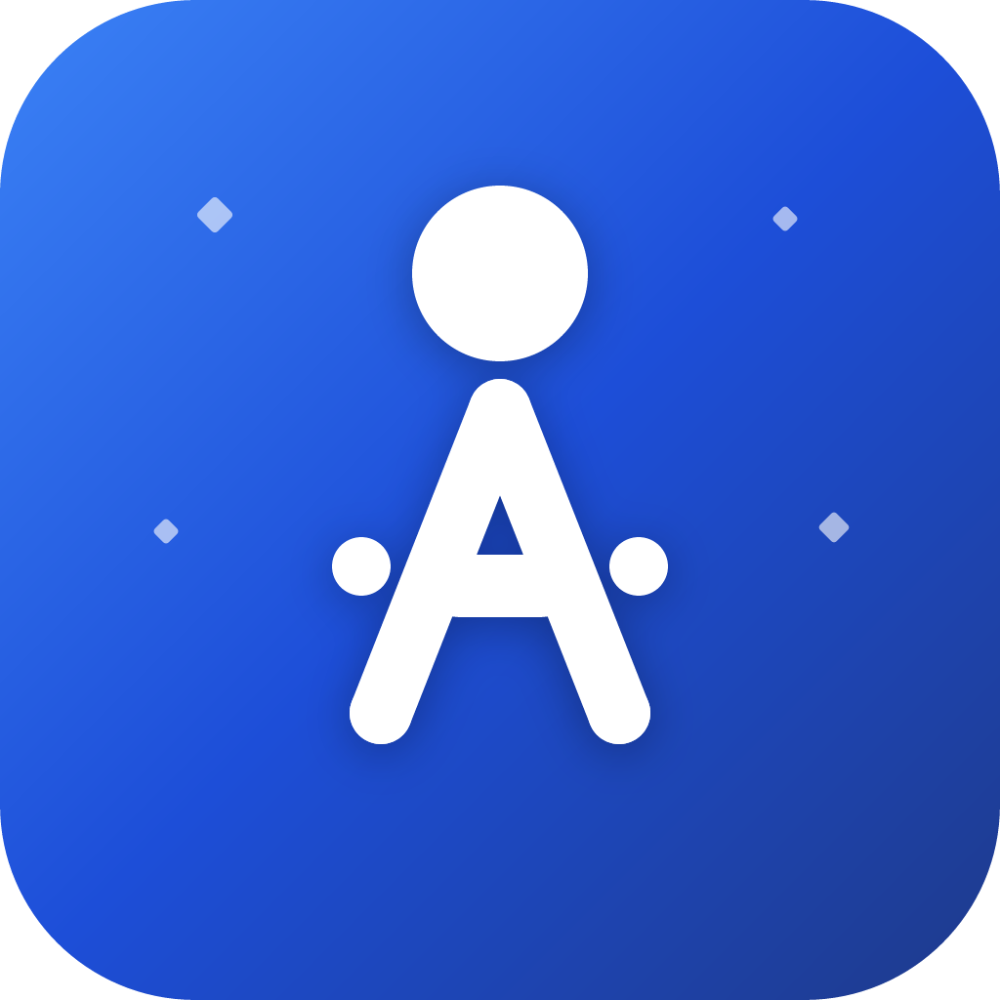
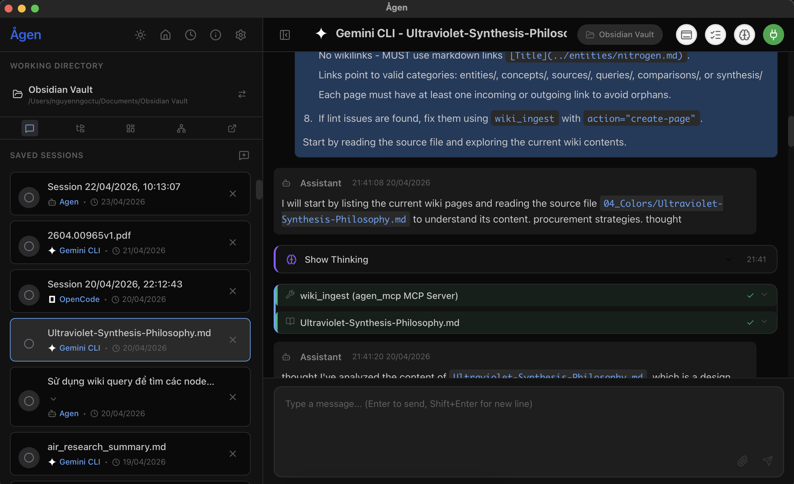
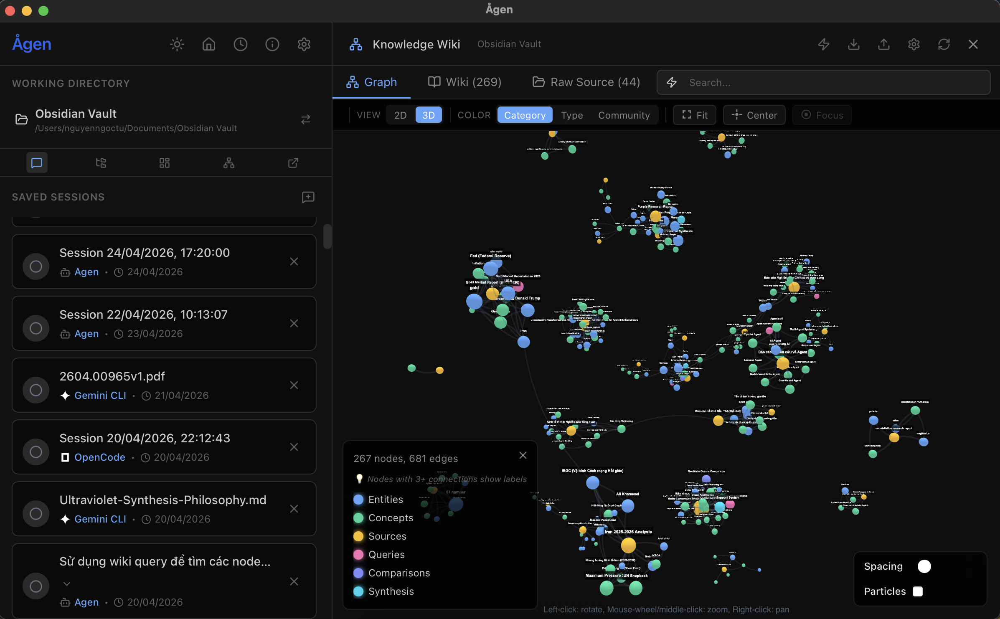
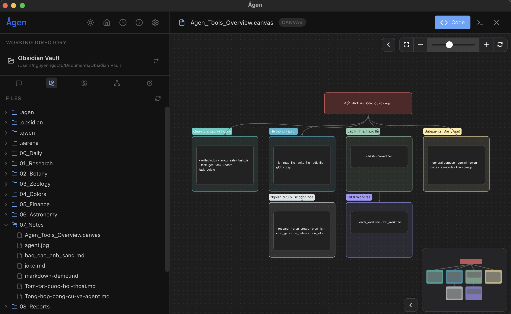
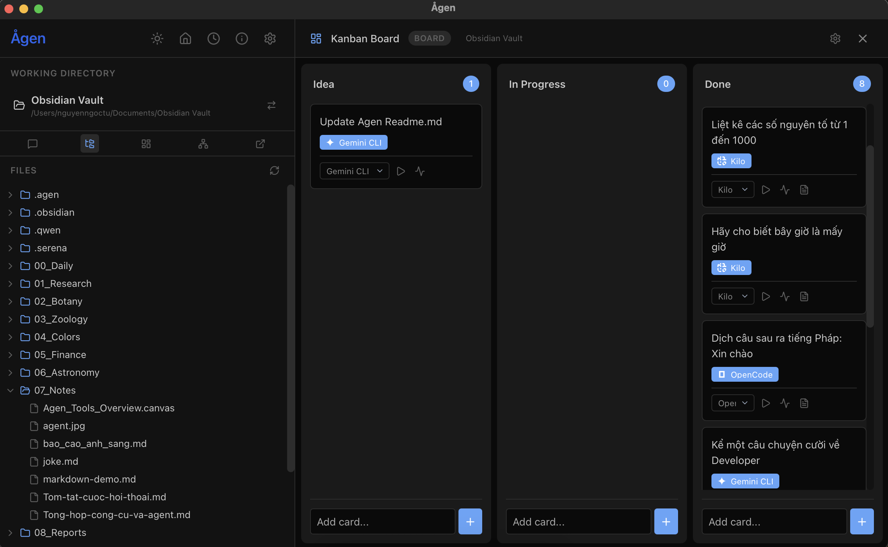
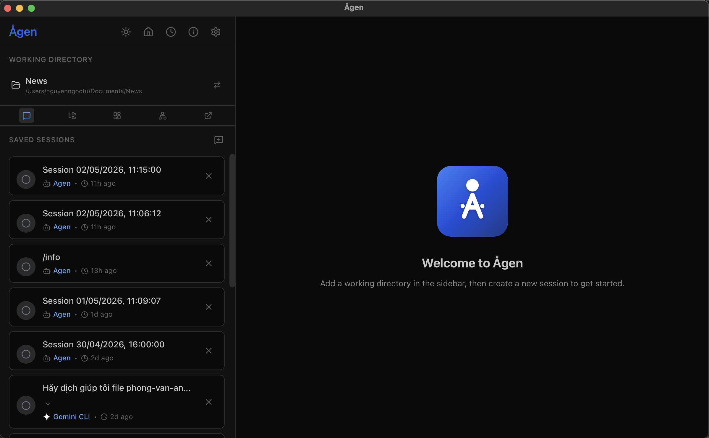
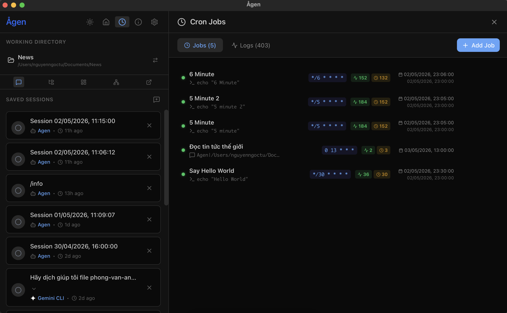
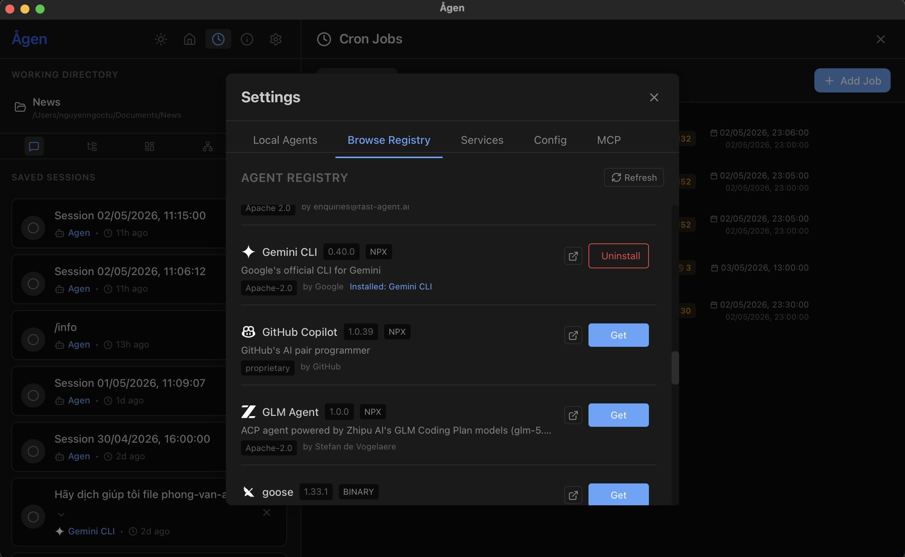
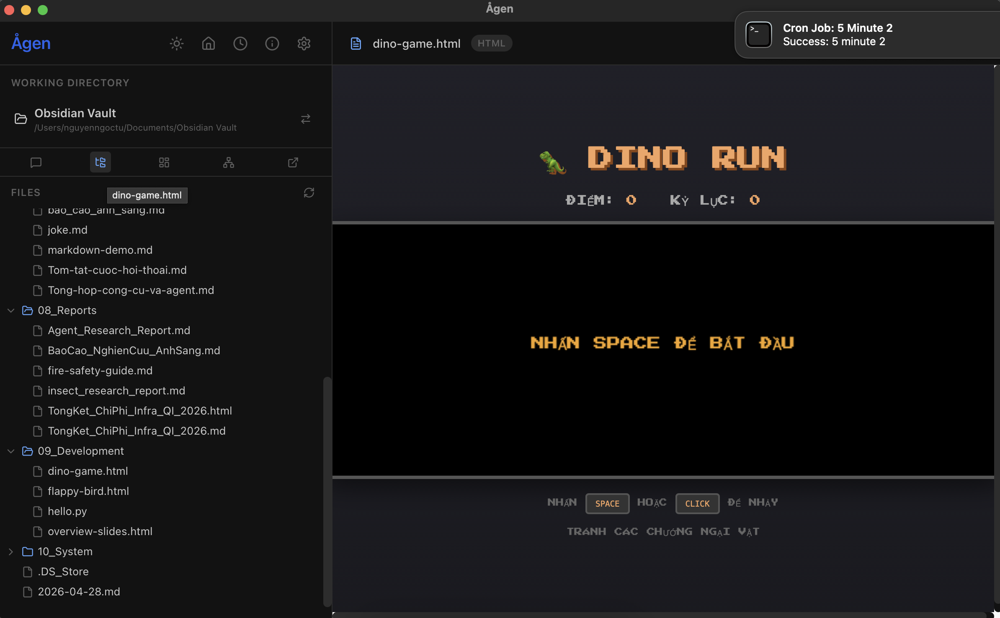

# Ågen

  
   
  <b>A Modern Desktop Client for AI Coding Agents</b>
   
  <i>Fully compatible with Agent Client Protocol (ACP) and Model Context Protocol (MCP)</i>

  
  

## 🚀 Introduction

**Ågen** is a powerful desktop application designed to be the control center for AI-powered coding agents. Based on the **Agent Client Protocol (ACP)**, Ågen allows you to connect and interact with various AI agents such as GitHub Copilot, Claude Code, Gemini CLI, and more from a single, unified, and smooth interface.

Built to provide a high-speed, low-resource, and highly secure native application experience.

## 📸 Screenshots

Click to view application screenshots

## ✨ Highlight Features

### 🤖 Multi-Agent & Multi-Session
- **Support All ACP Agents**: Connect to any agent that complies with the ACP standard.
- **Session Management**: Store, manage, and resume conversations at any time.
- **Agent Modes**: Flexibly switch between working modes (Ask, Code, Architect, etc.) based on your needs.

### 📝 Intelligent Chat Interface
- **Markdown & Syntax Highlighting**: Display code beautifully with full syntax coloring.
- **AI Thinking**: View the AI's thinking and reasoning process directly (collapsible).
- **Slash Commands (/)**: Quick access to agent commands using the `/` syntax.
- **Permission Control**: Approve or deny sensitive actions (like writing files, running terminal commands) before the AI executes them.

### 🛠️ Integrated Productivity Tools
- **Wiki System**: Build your "second brain" with a tree-style Wiki manager. This knowledge base serves both you and your AI agents, allowing them to autonomously query and learn from your documentation via built-in MCP tools.
- **Kanban Board**: Create task cards, manage project workflows, and assign specific jobs to different AI agents to execute in parallel.
- **Cron Jobs**: Schedule and automate repetitive tasks with a powerful Cron manager.
- **File Editor**: Browse directory trees and edit code directly without leaving the app.
- **PDF & Image Support**: Directly view attached documents right in the chat frame.

### 🔍 Monitoring & Debugging
- **Traffic Monitor**: Real-time monitoring of JSON-RPC packets exchanged between the interface and AI agents.
- **Service Management**: Monitor status and control agents/services running in the background.
- **Integrated Terminal**: Run shell commands directly from the application.

### 🔌 Extensibility
- **MCP Support (Model Context Protocol)**: Integrate MCP servers to extend AI capabilities with new tools and contexts.
- **Environment Variables**: Flexibly configure API keys and settings for each individual agent.

---

## 🎯 Pre-configured Agents

Ågen comes pre-configured for quick connection with today's most popular agents:

| Agent | Package (NPM/CLI) |
|-------|-------------------|
| **GitHub Copilot** | `@github/copilot-language-server` |
| **Claude Code** | `@zed-industries/claude-code-acp` |
| **Gemini CLI** | `@google/gemini-cli` |
| **Qwen Code** | `@qwen-code/qwen-code` |
| **Auggie CLI** | `@augmentcode/auggie` |
| **Codex CLI** | `@zed-industries/codex-acp` |
| **OpenClaw** | `openclaw` |

---

## 📋 Prerequisites

To successfully run AI agents and MCP servers via Ågen, you need to ensure the following runtime environments are installed on your system:

### Node.js (`npx`)
Many popular agents (like GitHub Copilot, Claude Code, Gemini CLI) are built on Node.js and run via `npx`.
- **Installation**: Download and install [Node.js](https://nodejs.org/) (Version 18 or higher is recommended).
- **Verification**: Open your terminal and run `node -v` and `npx -v` to ensure they are installed correctly.

### Python & uv (`uvx`)
Some agents and MCP servers (like OpenClaw) are built with Python and use `uvx` for fast execution.
- **Installation**: Install [uv](https://docs.astral.sh/uv/getting-started/installation/), an extremely fast Python package and project manager. 
  - macOS/Linux: `curl -LsSf https://astral.sh/uv/install.sh | sh`
  - Windows: `powershell -ExecutionPolicy ByPass -c "irm https://astral.sh/uv/install.ps1 | iex"`
- **Verification**: Open your terminal and run `uv -V` to verify the installation.

---

## 📥 Installation

1. Go to the [Releases](https://github.com/axitdn/agen-app/releases) page.
2. Download the installer for your operating system (macOS, Windows, or Linux).
3. Install and run Ågen!

*Note: The application has built-in auto-update functionality, so you will always be on the latest version.*

---

## 🛠️ Configuration

Ågen stores its configuration files in the following standard application directories depending on your OS:

- **macOS**: `~/Library/Application Support/agen/`
- **Windows**: `%APPDATA%\agen\`
- **Linux**: `~/.config/agen/`

### `agents.json`
Stores your connected ACP agents, environment variables, and specific configurations. You can edit this file directly or use the Settings interface in the application to add/update agents.

### `mcp-servers.json`
Stores the configuration for custom Model Context Protocol (MCP) servers. Use this file or the Settings interface to configure the executable paths, arguments, and environment variables for your MCP extensions.

---

## 📄 License

The project is released under the **MIT** license.

---

  <i>Developed with ❤️ for the AI and Developer community.</i>

